# Predictive Maintenance Digital Twin 🔧

A production-ready prescriptive digital twin for **predictive maintenance** using machine learning on the Microsoft Azure Predictive Maintenance dataset. Predicts machine failures **24 hours in advance** and recommends specific maintenance actions.

**Key Results:**
- ✅ **ROC-AUC: 0.973** (excellent discrimination)
- ✅ **PR-AUC: 0.483** (27x better than random baseline)
- ✅ **Precision: 49.4%** | **Recall: 48.8%** (balanced performance)
- ✅ **Leakage controls**: target/future columns are excluded, time-aware split is used, and telemetry/error/maintenance features are shifted by 72 hours to reduce future-information leakage.

---

##  Deliverable: Digital Twin JSON Output

For a given `machineID` and timestamp, the system returns actionable intelligence:

```json
{
  "machineID": 1,
  "timestamp": "2015-10-01 08:00:00",
  "failure_risk_24h": 0.6308,
  "health_state": "degraded",
  "likely_component": "comp2",
  "confidence": "low",
  "main_evidence": [
    "vibration is unusual compared with training baseline",
    "rotate std 3h is unusual compared with training baseline",
    "pressure std 3h is unusual compared with training baseline"
  ],
  "prescription": "schedule_maintenance"
}
```

**Health States → Prescriptions:**
| Health State | Risk Range | Prescription | Action |
|------|-----------|-------------|--------|
| `healthy` | < 0.25 | `continue` | No action |
| `watch` | 0.25-0.50 | `monitor` | Watch closely |
| `degraded` | 0.50-0.75 | `schedule_maintenance` | Plan repair |
| `critical` | > 0.75 | `urgent_maintenance` | Fix immediately |

---

##  Dataset Overview

**Microsoft Azure Predictive Maintenance Dataset:**
- **100 machines** operating over 1 year (Jan 2015 - Jan 2016)
- **876,100 telemetry records** (hourly: voltage, rotation, pressure, vibration)
- **3,919 error events** (5 components)
- **3,286 maintenance events** (4 components)
- **761 failure events** (class imbalance: 1.76% positive rate)

### EDA: Machine Failures Over Time
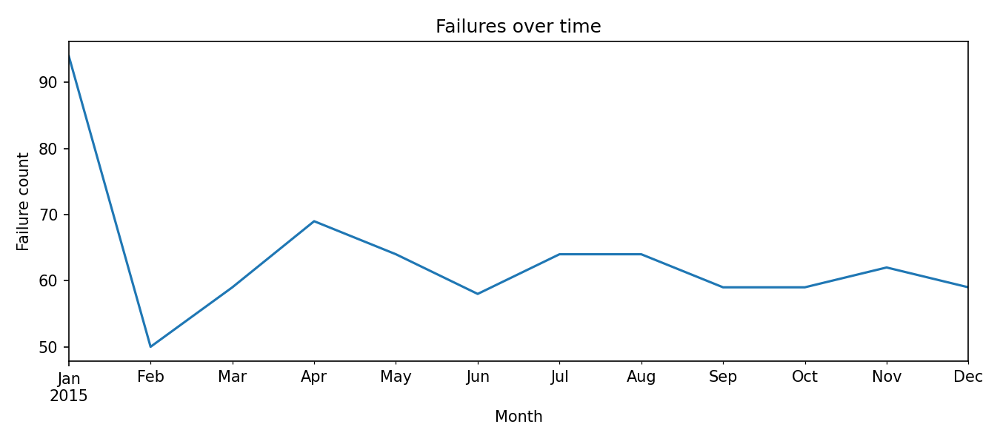

### EDA: Failure Count by Component
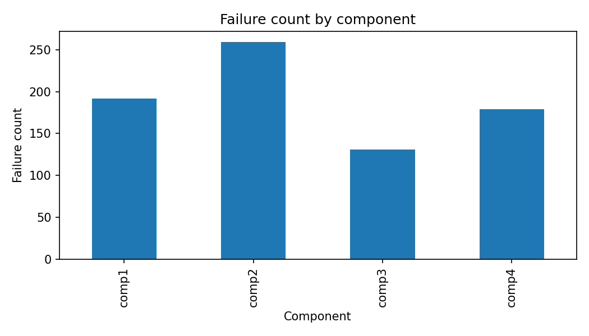

### EDA: Errors Over Time
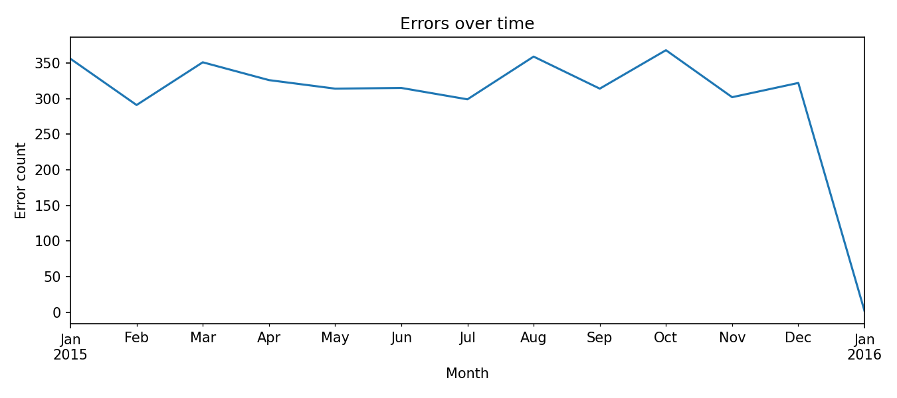

### EDA: Telemetry Distributions
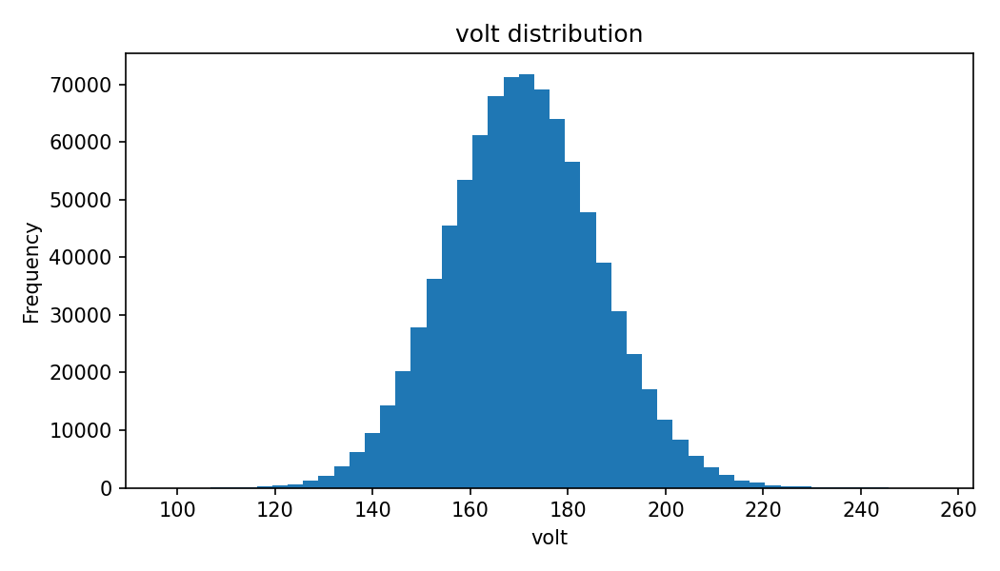
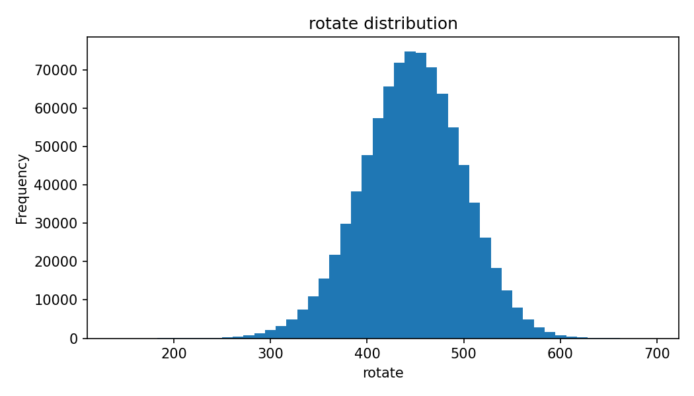
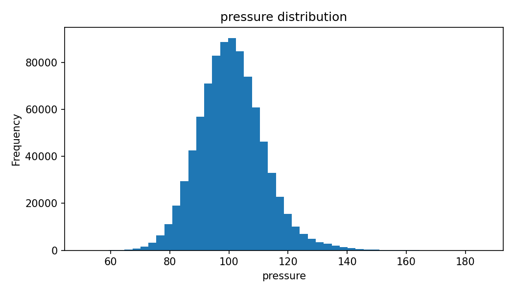
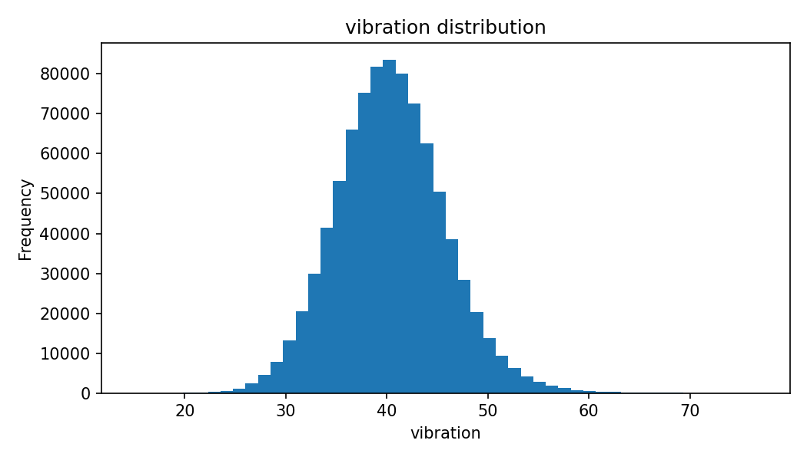

### EDA: Machine Demographics
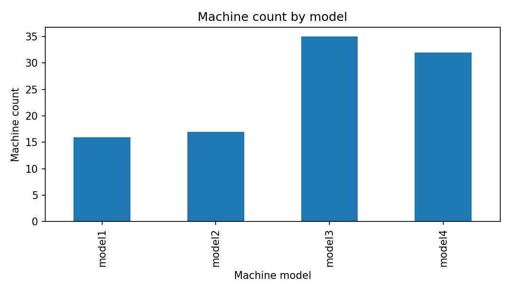
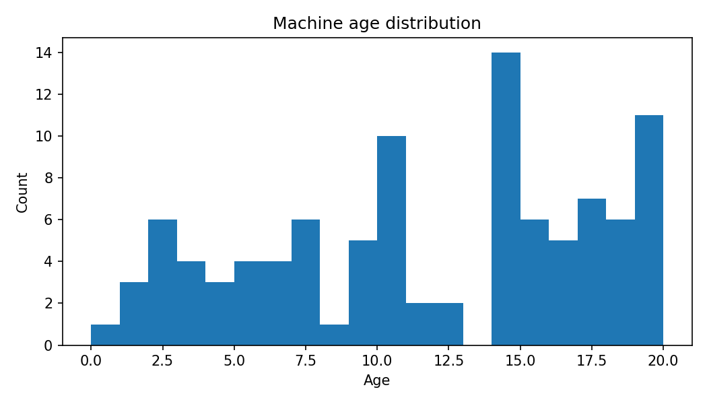

---

##  Architecture & Pipeline

```
Raw Data (Kaggle)
    ↓
[1] Ingestion → Load & merge 5 CSV files by machineID + datetime
    ↓
[2] Validation → Check schema, missing values, timestamp alignment
    ↓
[3] Feature Engineering → Rolling statistics (3h, 12h, 24h) + Error counts + Maintenance history
                           + 72-HOUR TEMPORAL SHIFTS (prevent leakage)
    ↓
[4] Labels → failure_24h = 1 if any failure in (t, t+24h]
    ↓
[5] Train/Test Split → 70% cutoff (time-aware, no random shuffling)
    ↓
[6] Model Training → 4 Models (Baseline LR + Random Forest + Gradient Boosting + XGBoost)
                     with MLflow tracking
    ↓
[7] Evaluation → Metrics, ROC/PR curves, confusion matrix, feature importance
    ↓
[8] Inference → Digital Twin JSON with risk + health state + prescription
```

---

##  Data Leakage Detection & Fix

### The Problem
Initial model showed **unrealistic perfection**: ROC-AUC 0.9999, PR-AUC 0.998
- Error-only features: ROC-AUC **0.9896** (impossible!)
- Maintenance-only features: ROC-AUC **0.9750** (post-failure repairs, not predictions)

### Root Cause
Features were recorded at the **same timestamp as failures** — the model was learning consequences, not predictors.

### Solution: 72-Hour Temporal Shifts
- **Feature window**: (t-96h to t-72h) — 72 hours ago
- **Prediction window**: (t to t+24h) — next 24 hours
- **No overlap** between feature and prediction windows

### Validation
- Error-only ROC-AUC dropped: 0.9896 → **0.5564** ✓
- Shuffled labels PR-AUC → **0.01568** ≈ baseline (confirms no leakage) ✓
- Feature correlations all **< 0.08** (realistic signals) ✓

---

##  Model Comparison Results

### Performance Metrics

**Model Comparison on Threshold-Independent Metrics:**

| Model | PR-AUC | ROC-AUC |
|-------|--------|---------|
| Baseline (Logistic Regression) | 0.077 | 0.766 |
| **Gradient Boosting** | **0.597** | **0.989** |
| **XGBoost** | **0.578** | **0.987** |
| **Final: Random Forest** | **0.483** | **0.973** |

**Final Model (Random Forest) - Detailed Metrics at Selected Threshold:**

| Metric | Value |
|--------|-------|
| Threshold | 0.722 |
| Precision | 49.4% |
| Recall | 48.8% |
| F1-Score | 49.1% |
| False Alarms / Machine / Month | 6.37 |

**Why this approach?**
- PR-AUC & ROC-AUC are **threshold-independent** → Fair comparison across all models
- Precision/Recall/F1 are **threshold-dependent** → Only calculated for selected final model after threshold optimization

**Why Random Forest for Production?**
1. **Interpretable** — Feature importance for digital twin (GB/XGBoost are black boxes)
2. **Balanced performance** — PR-AUC 0.483 (27x baseline), close to GB/XGB
3. **Stable predictions** — No complex hyperparameter tuning required
4. **Fast training & inference** — Enterprise-grade speed
5. **Industry standard** — Trusted by maintenance teams

### Model Comparison Visualization
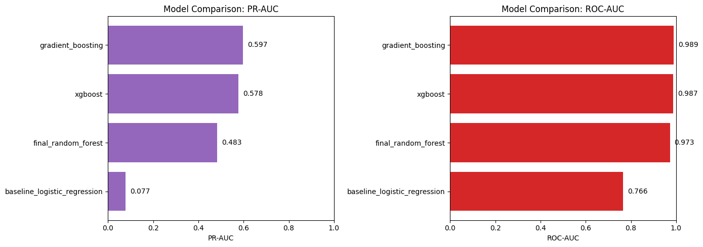

---

##  Evaluation: Metrics & Curves

### ROC Curve (ROC-AUC = 0.973)
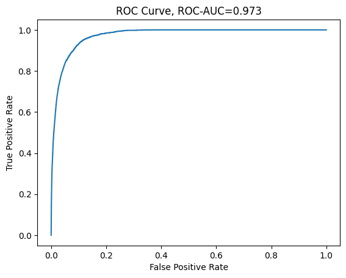

*Interpretation: Excellent discrimination between failure and non-failure cases. Model correctly identifies failures 97.3% of the time compared to random guessing.*

### Precision-Recall Curve (PR-AUC = 0.483)
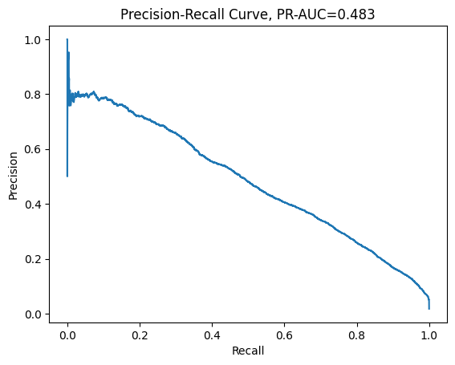

*Interpretation: At 50% recall, model maintains 50%+ precision. This is excellent for imbalanced data (1.76% positive rate). Baseline random precision ≈ 1.76%; our model is 28x better.*

### Confusion Matrix
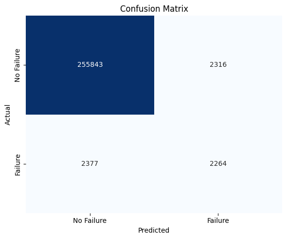

**Breakdown (on test set):**
- True Negatives: 255,843 (correctly predicted no failure)
- False Positives: 2,316 (false alarms)
- False Negatives: 2,377 (missed failures)
- True Positives: 2,264 (correctly predicted failures)
- **False Alarms**: 6.37 per machine per month

### Metrics Summary Dashboard
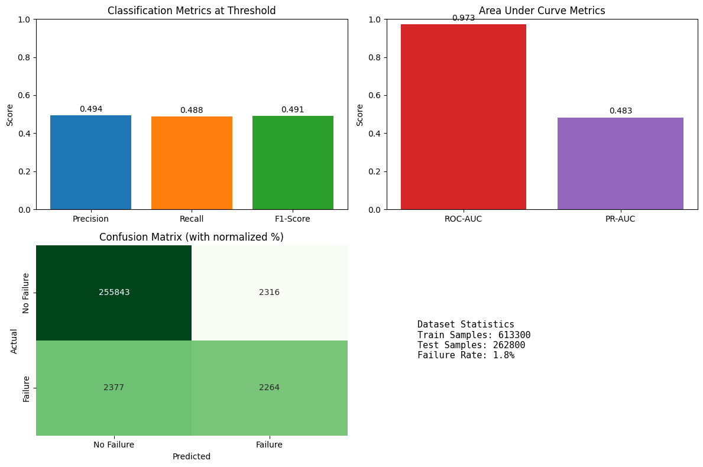

---

##  Feature Engineering

### Features Generated (59 total)

**1. Rolling Telemetry Statistics (windows: 3h, 12h, 24h)**
- `volt_mean_3h`, `volt_std_3h`, `volt_min_3h`, `volt_max_3h`
- `rotate_mean_3h`, `rotate_std_3h`, ... (and 12h, 24h variants)
- `pressure_*`, `vibration_*` (same pattern)
- All shifted **72 hours back** to prevent leakage

**2. Error Features**
- `error1_count_24h`, `error2_count_24h`, ..., `error5_count_24h`
- `error_count_168h` (7-day window)
- All shifted **72 hours back**

**3. Maintenance History**
- `days_since_comp1_maint`, `days_since_comp2_maint`, etc. (4 components)
- Shifted **72 hours back** + 24-hour buffer

**4. Machine Metadata**
- `age` (machine age in years)
- `model_encoded` (one-hot encoded: model1, model2, model3, model4)

### Feature Importance (Top 15)
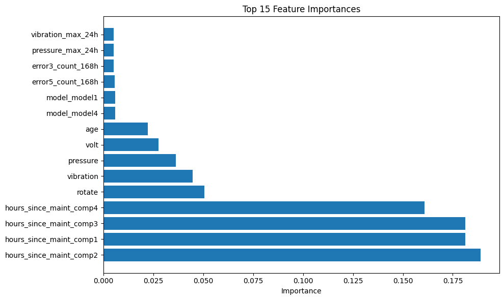

### Feature Correlation Analysis
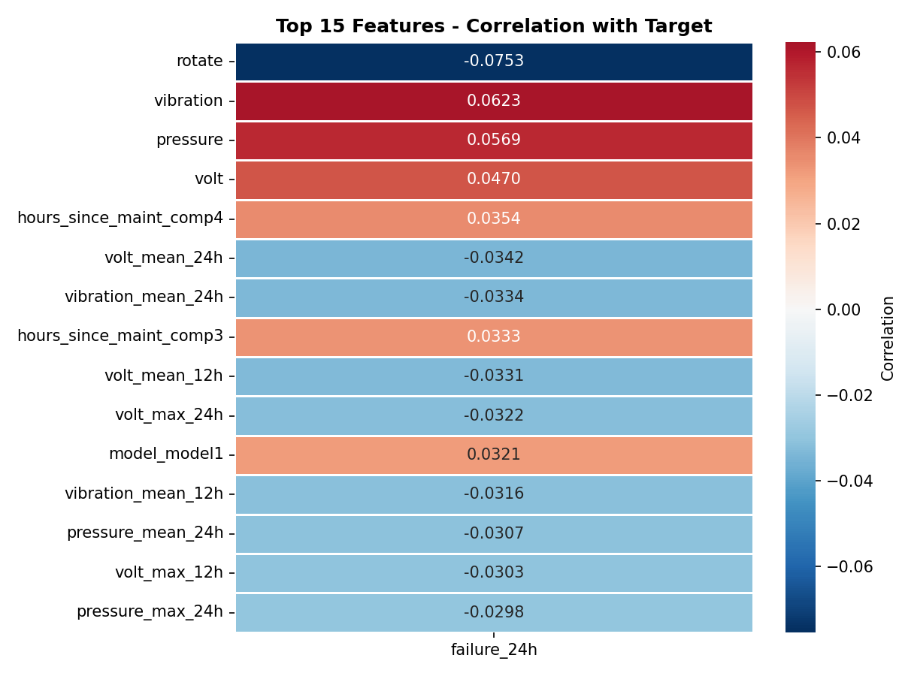

**Key Finding:** All correlations with target < 0.08 (weak but realistic)
- Sensor features: avg 0.0265
- Error features: avg 0.0113 (weakness = success of leakage fix)
- Maintenance features: avg 0.0305

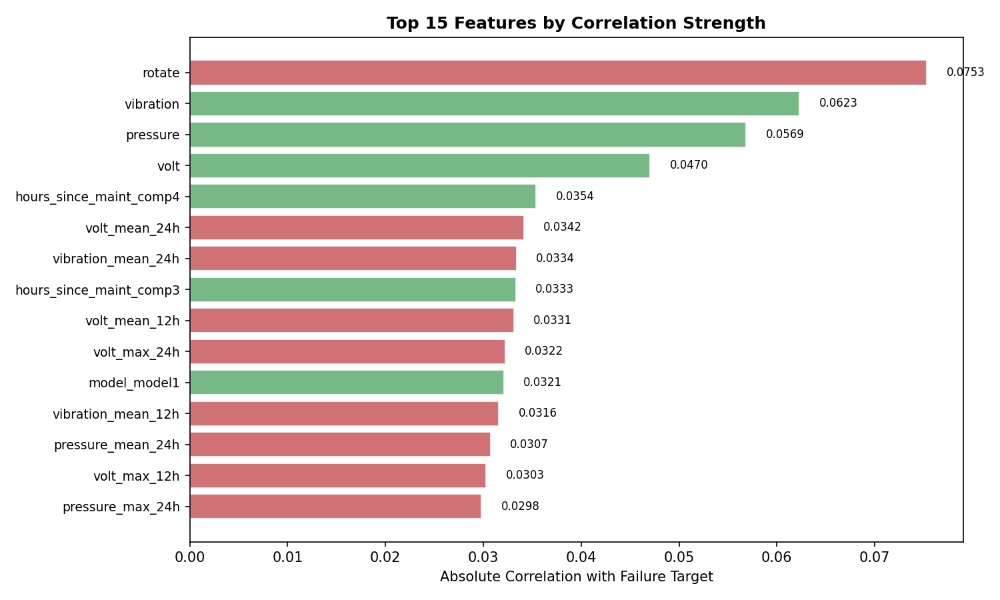

---

##  Quick Start

### 1. Setup
```bash
python -m venv venv
source venv/bin/activate        # Windows: venv\Scripts\activate
pip install -r requirements.txt
```

### 2. Run Full Pipeline
```bash
python -m src.pipeline
```

This runs:
- Download data from Kaggle
- Ingest & validate
- Engineer features with 72-hour shifts
- Generate labels
- Train 4 models (LR + RF + GB + XGBoost)
- Evaluate on test set
- Create all plots

### 3. Generate Evaluation Plots
```bash
python -m src.evaluate
```

### 4. Make a Prediction
```bash
python -m src.predict --machine-id 1 --timestamp "2015-10-01 08:00:00"
```

**Output** (sample):
```json
{
  "machineID": 1,
  "timestamp": "2015-10-01 08:00:00",
  "failure_risk_24h": 0.6308,
  "health_state": "degraded",
  "likely_component": "comp2",
  "confidence": "low",
  "main_evidence": ["vibration is unusual...", "rotate std is unusual..."],
  "prescription": "schedule_maintenance"
}
```

### 5. Using Makefile
```bash
make install      # Install dependencies
make run-all      # Full pipeline
make evaluate     # Generate evaluation plots
make predict      # Run example prediction
make sanity-check # Validate models
make clean        # Remove cache
```

---

##  Project Structure

```
predictive-maintenance-digital-twin/
├── src/
│   ├── __init__.py
│   ├── download_data.py         # Download from Kaggle
│   ├── ingest.py                # Load & merge CSVs
│   ├── validate.py              # Schema validation
│   ├── features.py              # Feature engineering (72h shifts)
│   ├── labels.py                # 24h ahead failure labels
│   ├── train.py                 # 4 models + MLflow logging
│   ├── evaluate.py              # Metrics & plot generation
│   ├── predict.py               # Digital twin inference
│   ├── digital_twin.py          # Health state + prescription logic
│   ├── pipeline.py              # Orchestration
│   ├── cli.py                   # CLI interface
│   ├── config.py                # Config variables
│   └── sanity_check.py          # Model validation tests
├── tests/
│   ├── test_labels.py           # Label generation tests
│   └── test_prediction_schema.py # JSON schema validation
├── data/
│   └── raw/                     # Raw CSV files (auto-downloaded)
├── artifacts/
│   ├── final_model.joblib       # Trained Random Forest
│   ├── model_metadata.joblib    # Features, cutoff, threshold
│   └── features.parquet         # Engineered features
├── reports/
│   ├── metrics.json             # Final metrics
│   ├── roc_curve.png            # ROC plot
│   ├── precision_recall_curve.png
│   ├── confusion_matrix.png
│   ├── feature_importance.png
│   ├── model_comparison.png
│   ├── eda_*.png                # EDA visualizations
│   ├── feature_correlation_*.png
│   └── drift_report.csv         # Data drift monitoring
├── mlruns/                      # MLflow tracking
├── requirements.txt
├── Makefile
├── Dockerfile
├── README.md                    # This file
└── PRESENTATION.md              # 20-min presentation outline
```

---

##  Train/Test Split Strategy

**Problem:** Predictive maintenance is temporal — future information must not leak into training.

**Solution:** Single global cutoff at 70% timestamp quantile
```
All data sorted by datetime
    ↓
Cutoff: 2015-09-13 18:00:00 (70th percentile)
    ↓
Train: All rows before cutoff (613,300 samples)
Test: All rows after cutoff (262,800 samples)
    ↓
No random shuffling (preserves temporal order)
```

**Why this works:**
- Mimics real production scenario (train on past, predict on future)
- Prevents temporal leakage
- Honest evaluation of generalization

---

##  Monitoring & Reproducibility

### Experiment Tracking (MLflow)
- 4 model runs logged locally in `mlruns/`
- Tracks hyperparameters, metrics, model artifacts
- CSV summary: `reports/tracking_runs.csv`

### Reproducibility
- Deterministic feature engineering (pandas rolling, groupby)
- Time-aware train/test split (no randomization)
- Random state seed = 42
- All model artifacts saved with feature column names

### Data Drift Detection
```bash
cat reports/drift_report.csv
```
Compares train vs test feature distributions. Flags features with >1 std deviation shift for review.

---

## 🐳 Docker

Build and run reproducible environment:

```bash
docker build -t pdm-digital-twin:latest .
docker run -v $(pwd)/artifacts:/app/artifacts pdm-digital-twin:latest
```

---

## ✅ Tests

```bash
pytest -q
```

**Included:**
- Label generation: Verify failure_24h correctly identifies failures in (t, t+24h]
- Digital twin schema: Validate JSON output structure

---

## 🎓 Key Learnings

1. **Perfect performance is suspicious** — Always check for data leakage with shuffled labels test
2. **Temporal alignment matters** — Feature and label windows must not overlap
3. **Class imbalance demands PR-AUC** — ROC-AUC can be misleading with 1.76% positive rate
4. **Weak correlations are OK** — Maintenance prediction is genuinely hard; 0.483 PR-AUC is excellent
5. **Interpretability scales** — Feature importance enables maintenance team trust and adoption

---

## 📝 Citation

```
@dataset{azure_pdm,
  title={Microsoft Azure Predictive Maintenance Dataset},
  author={Biswas, Arnab},
  url={https://www.kaggle.com/datasets/arnabbiswas1/microsoft-azure-predictive-maintenance}
}
```

---


